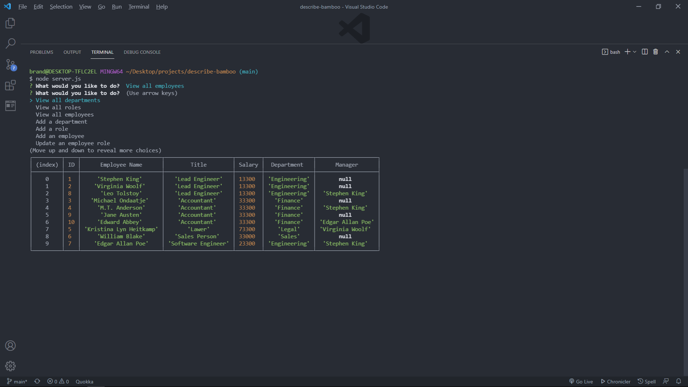

<h1 align="center">Employee Manager</h1>

# Description

A CLI used in conjunction with node, inquirer, and a mysql db to update and maintain an employee database.

 
[Demo (view full screen)](https://drive.google.com/file/d/1xHhYsSifbOb68_elTleCt8xl9z5Xmrky/view)
 

# Table of Contents

- [Installation](#installation)
- [Usage](#usage)
- [License](#license)
- [Contributing](#contributing)
- [Tests](#tests)
- [Questions](#questions)
- [Screen Shot](#screenshot)

# Installation

Clone, run npm install from your command line, set up db connection, run schema and seeds, then run node server.js.

# Usage

Please use at your own risk.

# License

> Project is licensed under the **MIT License** - see the [License URL](https://choosealicense.com/licenses/mit) page for specific info for this license.

# Contributing

No guidelines at this time. 

# Tests

Test using command line.

# Questions 

Brandon Stewart

[My Github account](https://github.com/brandon-stewart-rgb)
Have any questions about this project?  
<a href="brandon@brandon.com">Email Me</a>

# Screenshot

